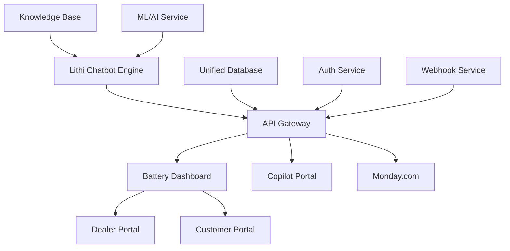

# Lithi Ecosystem Integration Plan
## Building a Unified Enterprise Brain

### Overview
This document outlines the comprehensive plan to integrate the entire Lithi ecosystem into a unified, enterprise-grade system that functions as a connected brain across all platforms.

### Current Architecture Components

1. **Lithi Chatbot** (`/lithi-chatbot/`)
   - AI-powered chatbot with OpenAI integration
   - Knowledge base system
   - Monday.com integration
   - Copilot integration
   - Session management

2. **Battery Dashboard** (`/battery-dashboard/`)
   - Dealer portal (B2B)
   - Customer portal (B2C)
   - Order management
   - Product catalog
   - Analytics
   - Shipping management

3. **Copilot Portal** (`/copilot-portal/`)
   - Customer support integration
   - Monday.com workflow automation
   - Real-time chat features

### Integration Architecture

### Phase 1: API Gateway & Authentication
1. Create centralized API gateway
2. Implement JWT-based authentication across all services
3. Set up service-to-service communication
4. Create webhook management system

### Phase 2: Database Integration
1. Implement database migrations
2. Create unified data models
3. Set up real-time synchronization
4. Implement event sourcing

### Phase 3: Service Integration
1. Connect Lithi chatbot to portals
2. Implement real-time chat in dashboards
3. Create unified notification system
4. Set up workflow automation

### Phase 4: Knowledge Base & AI
1. Create centralized knowledge base
2. Implement context-aware AI responses
3. Set up machine learning pipelines
4. Create personalized experiences

### Phase 5: Enterprise Features
1. Implement advanced security
2. Create audit logging system
3. Set up monitoring & alerting
4. Implement performance optimization